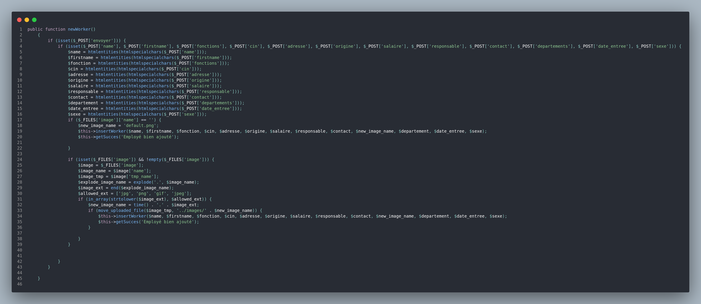
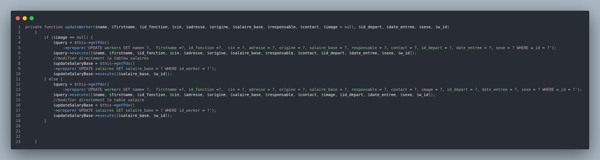
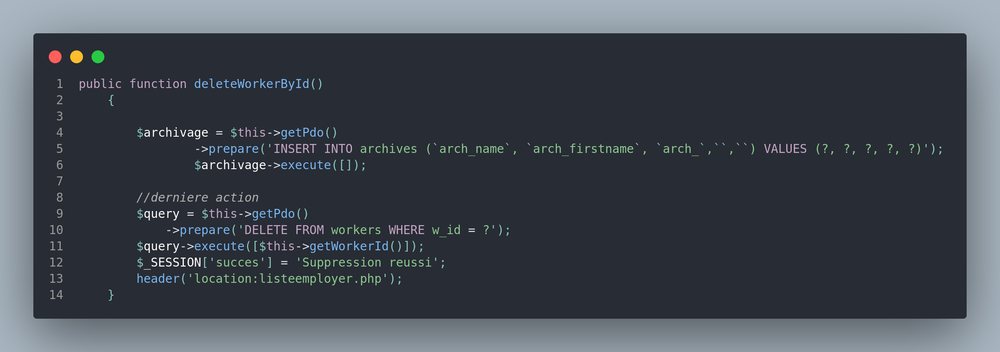
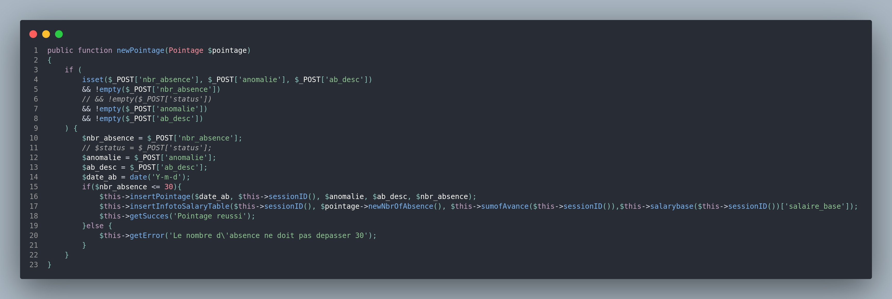
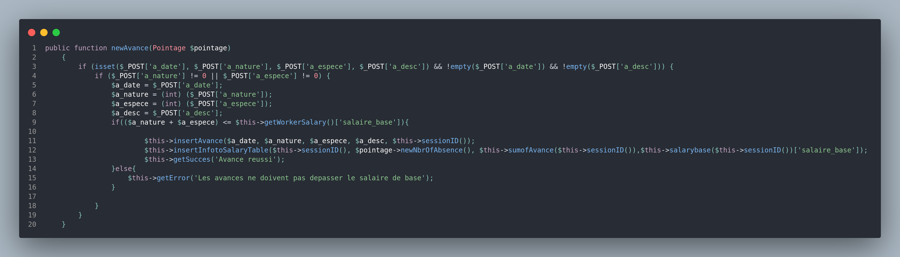
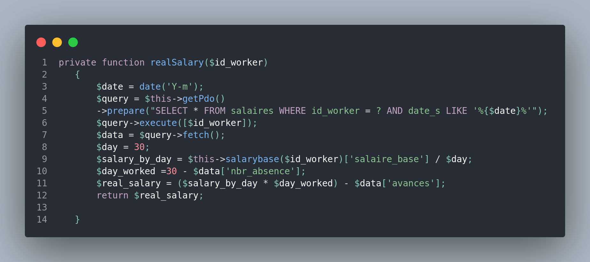
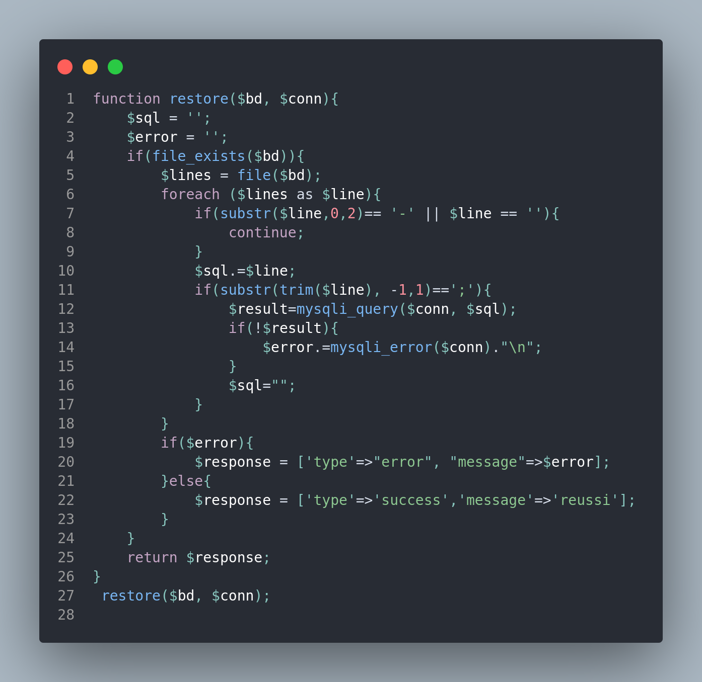

# Gestion d'employés
Application Web de gestion d'employé et de calcul de salaire, avec un archivage automatique.coder en POO PHP, Javascript, HTML/CSS, Bootstrap, MYSQL
### Fonctionnalités
`Creation d'un employé`

`Modification d'un employé`

 `Suppression d'un employé`

 `Pointage d'un employé`

 `Donner un Avance à un employé`

 `Calcul de Salaire`

  `Sauvegarde de base de donnée`

## Technos utilisé

[`POO/PHP javascript Ajax HTML/CSS Bootstrap Mysql`]

 ### [Author]:Brandon Fidelin Ravomanana(branGitFox)
